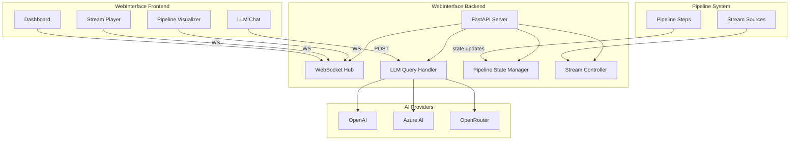

# Mimir-AIP Web Interface Implementation Plan

## Analysis of Current Implementation

1.  **Backend**: FastAPI server with WebSocket support
2.  **Frontend**: Modular JavaScript components
3.  **Features**:
    *   LLM Chat (integrated with multiple AI providers, how do I integrate this with the llm provider plugions I already have for the mimir python backend?)
    *   Pipeline Visualization (real-time updates)
    *   Live Stream Playback (HLS support)
    *   Dashboard Sections (dynamic content)

## LLM Chat API Key Handling

API keys are managed server-side via environment variables. The frontend makes requests to the `/llm-query` endpoint. The system supports multiple providers, which are configurable per request.

## Integration Points

*   Pipeline state updates via WebSocket
*   Context-aware LLM queries
*   Stream player initialization/control

## High-Level Implementation Plan

## Next Steps

1.  Enhance WebInterface with:
    *   File upload/download endpoints
    *   Chart.js integration for data visualization
    *   Improved error handling
    *   Real-time pipeline I/O
2.  Maintain pipeline-agnostic design
3.  Add comprehensive tests
4.  Update documentation