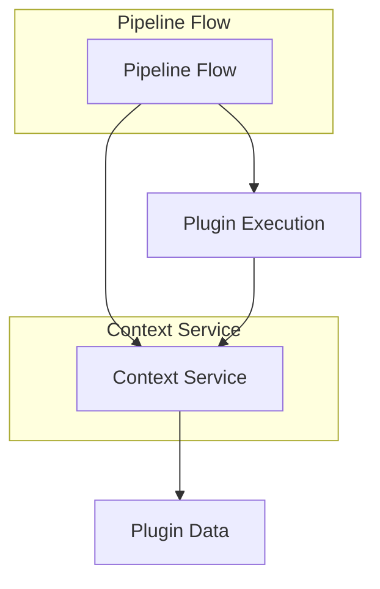
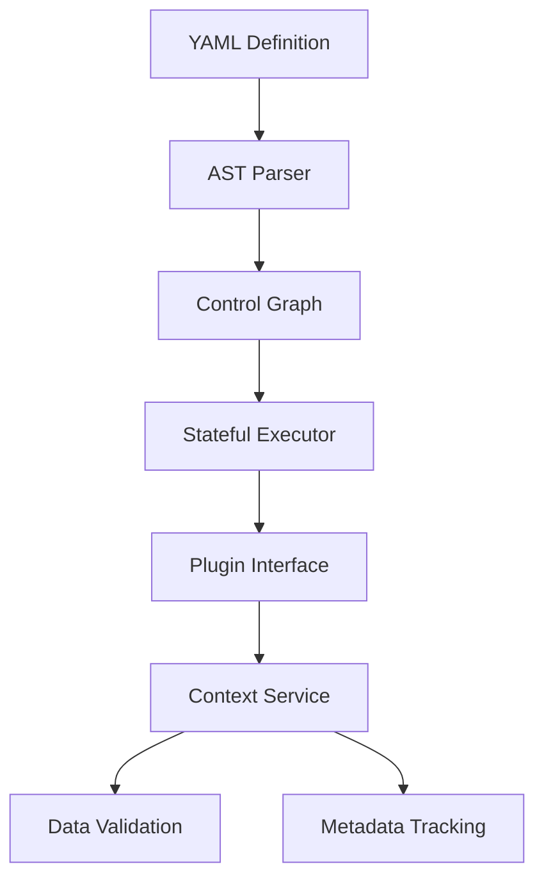
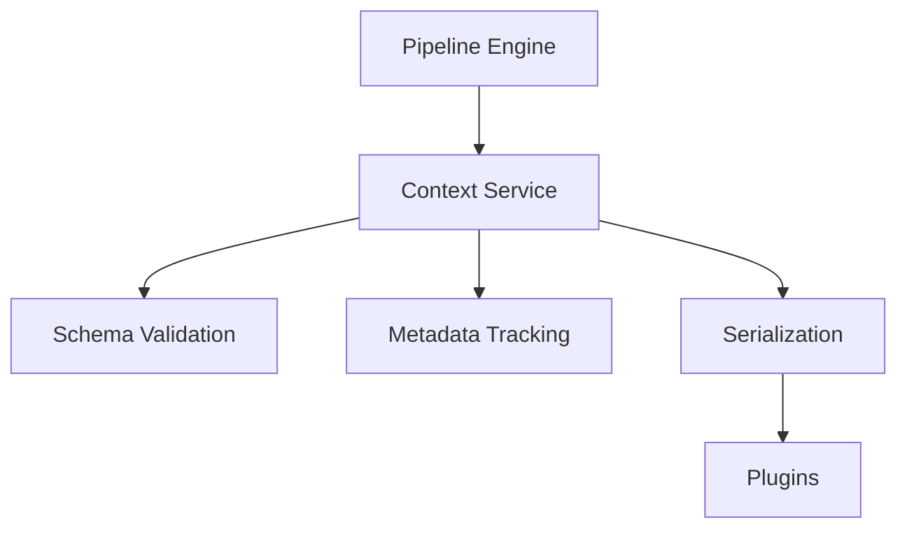

# Mimir AIP Pipeline Overhaul Plan

## Project Goals

### Pipeline Flow Improvements
1. Enable complex workflow patterns:
   - Conditional execution (if/else branches)
   - Looping constructs (for/while)
   - Step jumping/labeling (GOTO-like flow)
2. Improve maintainability:
   - Extract flow logic from main.py
   - Create dedicated pipeline engine module
   - Standardize control flow syntax
3. Enhance reliability:
   - Add comprehensive error handling
   - Implement step timeouts
   - Introduce pipeline validation

### Context System Improvements
1. Standardize data exchange:
   - Define common data formats
   - Support complex types (images, files)
   - Add schema validation
2. Improve traceability:
   - Track data lineage
   - Log context changes
   - Store execution metadata
3. Simplify plugin development:
   - Consolidate context-related plugins
   - Provide helper utilities
   - Document best practices

## 1. Core Architecture Changes

### Integrated Pipeline & Context Architecture


### Pipeline Flow Engine


### Pipeline Flow Implementation Tasks

#### Parser Module
- [ ] Create `PipelineParser` class
  - [ ] YAML → AST conversion
  - [ ] Syntax validation
  - [ ] Error reporting
- [ ] Implement `ControlGraph` class
  - [ ] Node/edge representation
  - [ ] Cycle detection
  - [ ] Visual debugging

#### Execution Engine
- [ ] Develop `StatefulExecutor`
  - [ ] Step pointer tracking
  - [ ] Loop stack management
    - [ ] Nested loop support
    - [ ] Break/continue handling
  - [ ] Conditional evaluation
    - [ ] Expression parsing
    - [ ] Type coercion
    - [ ] Error handling

#### Syntax Design
- [ ] Define YAML schema:
  - [ ] Conditional blocks:
    ```yaml
    if: "ctx.temp > 100"
    then: jump_to: emergency
    else: continue
    ```
  - [ ] Loop constructs:
    ```yaml
    for:
      items: "ctx.sensors"
      as: sensor
      index: idx
    ```
  - [ ] Step labels:
    ```yaml
    - label: emergency_protocol
      steps: [...]
    ```

### Context Service Implementation Tasks

#### Core Functionality
- [ ] Implement `ContextService` class
  - [ ] Data storage backend
  - [ ] Namespacing support
  - [ ] Access control

#### Data Handling
- [ ] Support data types:
  - [ ] Primitives (int, float, string)
  - [ ] Binary data (images, files)
  - [ ] References (file paths, URLs)
- [ ] Add validation:
  - [ ] Type checking
  - [ ] Required fields
  - [ ] Custom schemas

#### Metadata Tracking
- [ ] Implement audit logging:
  - [ ] Change history
  - [ ] Source tracking
  - [ ] Timestamps
- [ ] Add performance metrics:
  - [ ] Size limits
  - [ ] Access times
  - [ ] Memory usage

### Context Service Integration


## 2. Implementation Details

### Phase 1: Flow Control Foundation (2 weeks)
```python
# src/pipeline/engine.py
class PipelineEngine:
    def __init__(self, yaml_config):
        self.ast = PipelineParser.parse(yaml_config)
        self.state = ExecutionState()

    def execute(self):
        while self.state.step_ptr < len(self.ast.nodes):
            current_node = self.ast.nodes[self.state.step_ptr]
            self.process_node(current_node)

    def process_node(self, node):
        # Base implementation for linear execution
        plugin = PluginManager.get(node.plugin)
        result = plugin.execute(node.config, ContextService)
        self.state.step_ptr += 1
```

### Phase 2: Control Structures (3 weeks)
```yaml
# sample_pipeline.yaml
steps:
  - label: temp_check
    if: "ctx.sensors.temperature > 100"
    then:
      jump: emergency_protocol

  - name: process_items
    for:
      items: "ctx.sensor_readings"
      as: reading
      index: idx
    steps:
      - name: analyze_reading
        plugin: DataProcessing.Analyzer
```

## 3. Migration Strategy

### Backward Compatibility
```python
# src/main.py
def execute_pipeline(config):
    if config.get('version', 1) >= 2:
        PipelineEngine(config).execute()
    else:
        LegacyEngine(config).execute()
```

### Context Service Transition
```python
# Temporary adapter class
class ContextAdapter:
    def __init__(self):
        self.legacy_context = {}
        self.new_service = ContextService()

    def __setitem__(self, key, value):
        self.new_service.set(key, value, metadata={
            'source': 'legacy_adapter',
            'timestamp': datetime.now()
        })

    def __getitem__(self, key):
        return self.new_service.get(key) or self.legacy_context.get(key)
```

## 4. Roadmap & Timeline

| Phase | Duration | Pipeline Features | Context Features |
|-------|----------|-------------------|------------------|
| 1     | 2 weeks  | Core Engine       | Basic Validation |
| 2     | 3 weeks  | Control Flow      | Metadata Tracking|
| 3     | 1 week   | Plugin Integration| Full Serialization|

## 5. Risk Mitigation
- Feature flags for gradual rollout
- Automated conversion tool for legacy pipelines
- Dual execution engines during transition
- Comprehensive test suite for backward compatibility
