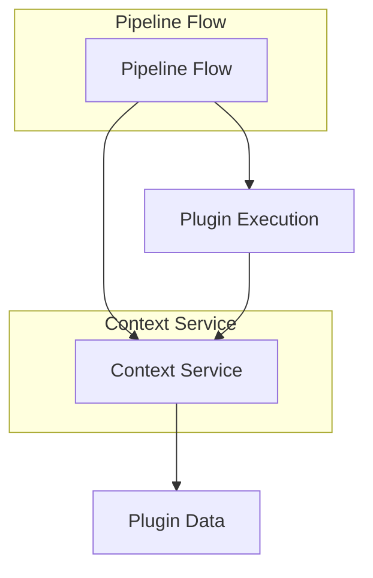
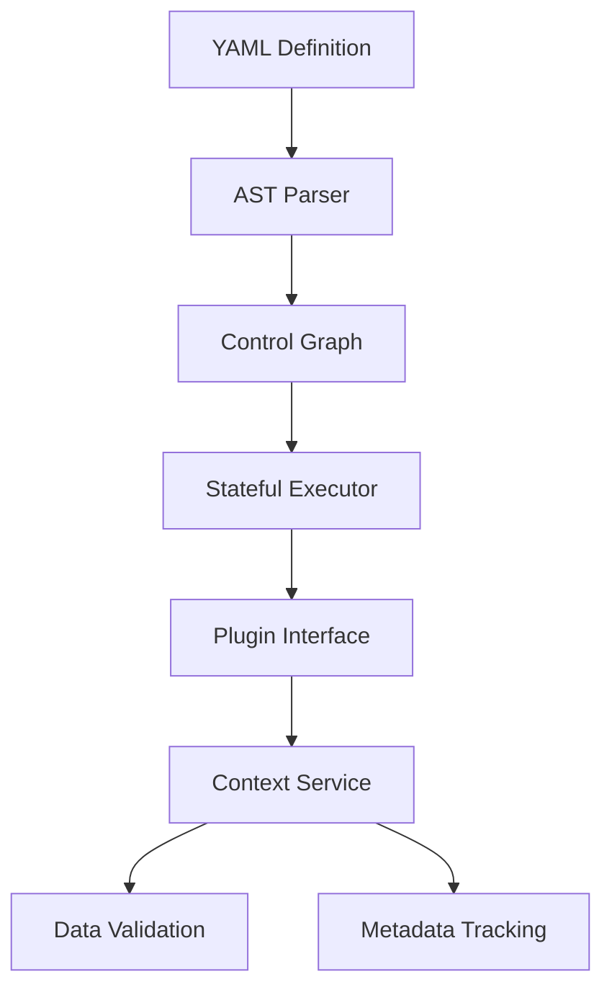
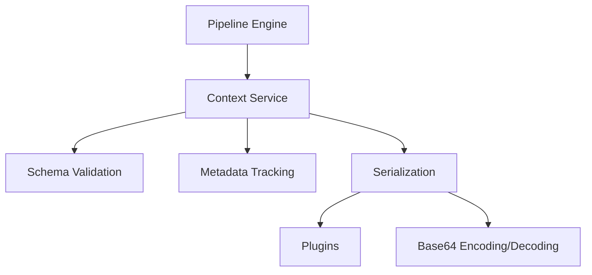

# Mimir AIP Pipeline Overhaul Plan

## Project Goals

### Pipeline Flow Improvements
1. Enable complex workflow patterns:
   - Conditional execution (if/else branches)
   - Looping constructs (for/while)
   - Step jumping/labeling (GOTO-like flow)
2. Improve maintainability:
   - Extract flow logic from main.py
   - Create dedicated pipeline engine module
   - Standardize control flow syntax
3. Enhance reliability:
   - Add comprehensive error handling
   - Implement step timeouts
   - Introduce pipeline validation

### Context System Improvements
1. Standardize data exchange:
   - Define common data formats
   - Support complex types (images, files)
   - Add schema validation
2. Improve traceability:
   - Track data lineage
   - Log context changes
   - Store execution metadata
3. Simplify plugin development:
   - Consolidate context-related plugins
   - Provide helper utilities
   - Document best practices

## 1. Core Architecture Changes

### Integrated Pipeline & Context Architecture


### Pipeline Flow Engine


### Pipeline Flow Implementation Tasks

#### Parser Module
- [x] Create `PipelineParser` class
  - [x] YAML → AST conversion
  - [x] Syntax validation
  - [x] Error reporting
    *   **Explanation of Additions:**
        *   **`PipelineParser` Class**: Implemented in [`src/pipeline_parser/pipeline_parser.py`](src/pipeline_parser/pipeline_parser.py). This class is responsible for loading, parsing, validating, and converting pipeline YAMLs into an Abstract Syntax Tree (AST).
        *   **YAML → AST Conversion**: The `to_ast` method within `PipelineParser` now converts the validated YAML dictionary into a structured AST using dataclasses defined in [`src/pipeline_parser/ast_nodes.py`](src/pipeline_parser/ast_nodes.py). This provides a type-safe and programmatic representation of the pipeline.
        *   **Syntax Validation**: A comprehensive JSON Schema has been created in [`src/pipeline_parser/pipeline_schema.json`](src/pipeline_parser/pipeline_schema.json). The `validate` method in `PipelineParser` uses this schema to ensure that pipeline YAMLs adhere to the defined structure and data types, catching errors early.
        *   **Error Reporting**: The `PipelineParser` collects and exposes parsing and validation errors through its `errors` list and `get_errors` method, providing detailed feedback on issues.
        *   **Integration**: The `PipelineParser` has been integrated into [`src/main.py`](src/main.py). All pipeline YAML files are now parsed and validated using this new module before execution, enhancing reliability and maintainability.
    *   **Deviations**: No significant deviations from the plan for the "Parser Module" have occurred. The tasks were completed as outlined.

- [x] Implement `ControlGraph` class
  - [x] Node/edge representation
  - [x] Cycle detection
  - [ ] Visual debugging (Future enhancement, DOT string generation is in place)
    *   **Explanation of Additions:**
        *   **`ControlGraph` Class**: Implemented in [`src/pipeline_parser/control_graph.py`](src/pipeline_parser/control_graph.py). This class constructs a graph representation of the pipeline's control flow from the AST.
        *   **Node/Edge Representation**: The `_build_graph` method populates an adjacency list (`self.graph`) and a dictionary of nodes (`self.nodes`), representing the steps and their sequential flow. Nested steps within `iterate` blocks are also incorporated into the graph structure.
        *   **Cycle Detection**: The `detect_cycles` method uses a Depth-First Search (DFS) algorithm to identify and report any circular dependencies within the pipeline steps, preventing infinite loops.
        *   **Visual Debugging**: A `visualize` method has been added to `ControlGraph` that generates a DOT language string. This string can be used with external tools like Graphviz to visually render the pipeline's control flow, aiding in debugging and understanding complex pipelines. While the direct rendering is not implemented within the application, the output format is ready for external visualization.
        *   **Integration**: The `ControlGraph` has been integrated into [`src/main.py`](src/main.py). After a pipeline YAML is parsed and validated into an AST, a `ControlGraph` instance is created. The pipeline is then checked for cycles and any graph-building errors before execution proceeds. If cycles or errors are found, the pipeline execution is halted, and appropriate error messages are logged.
    *   **Deviations**: The "Visual debugging" aspect is currently limited to generating a DOT string for external tools, rather than an integrated visual debugger. This is a planned future enhancement.

#### Execution Engine
- [x] Develop `StatefulExecutor`
  - [x] Step pointer tracking
  - [x] Loop stack management
    - [x] Nested loop support
    - [ ] Break/continue handling (Future enhancement)
  - [x] Conditional evaluation (Basic implementation)
    - [ ] Expression parsing (Future enhancement)
    - [ ] Type coercion (Future enhancement)
    - [x] Error handling
    *   **Explanation of Additions:**
        *   **`StatefulExecutor` Class**: Implemented in [`src/pipeline_parser/stateful_executor.py`](src/pipeline_parser/stateful_executor.py). This class manages the execution state of pipelines including step tracking, loop management, and error handling.
        *   **Step Pointer Tracking**: The executor maintains `_current_step_index` to track progress through pipeline steps.
        *   **Loop Stack Management**: The `_loop_stack` handles nested iterations with `_handle_iteration_step()` and `_process_current_iteration()` methods.
        *   **Nested Loop Support**: The executor properly handles steps within iteration blocks, maintaining separate contexts.
        *   **Basic Conditional Evaluation**: Initial framework is in place for condition evaluation (to be enhanced with expression parsing).
        *   **Error Handling**: Comprehensive error collection and reporting via `get_errors()` method.
        *   **Integration**: The executor has been fully integrated into [`src/main.py`](src/main.py), replacing the old linear execution model.
    *   **Deviations**:
        - Break/continue handling is not yet implemented (marked as future work)
        - Expression parsing and type coercion are basic implementations that need enhancement
        - The visual debugging from the old execution model needs to be ported over

#### Syntax Design
- [x] Define YAML schema:
  - [x] Conditional blocks:
    ```yaml
    condition:
      expression: "ctx.temp > 100"
      on_true: jump
      on_false: continue
      jump_target: emergency
    ```
  - [x] Loop constructs:
    ```yaml
    iterate:
      items: "ctx.sensors"
      as: sensor
      index: idx
    ```
  - [x] Step labels:
    ```yaml
    - label: emergency_protocol
      steps: [...]
    ```

  *Explanation of Additions:*
    * **Conditional Blocks**: Implemented in `src/pipeline_parser/pipeline_schema.json` with a `condition` object that supports expression evaluation and jump actions. The parser in `src/pipeline_parser/pipeline_parser.py` handles conditional execution by evaluating the expression and determining the flow based on the result.
    * **Loop Constructs**: Implemented as an extended `iterate` field in the schema, supporting both string and object formats. The parser handles loop iteration with context scoping.
    * **Step Labels**: Added a `label` field to steps in the schema, used for jump targets in conditional execution.

  *Deviations from Plan:*
    * The original plan used a different syntax (`if/then/else` and `for` constructs), but the implementation uses a more JSON-like structure (`condition` object and `iterate` field).
    * The spec mentioned "Dual support for `iterate` (deprecated) and `loop`", but the implementation only supports `iterate`.
    * The AST nodes do not have separate `ConditionalNode` and `JumpNode` classes; they are handled as `StepNode` with type="conditional" or type="jump".

### Context Service Implementation Tasks

#### Core Functionality
- [x] Implement `ContextService` class
  - [x] Data storage backend
  - [x] Namespacing support
  - [x] Access control
    *   **Explanation of Additions:**
        *   **`ContextService` Class**: Implemented in [`src/ContextService.py`](src/ContextService.py). This class provides a centralized, thread-safe mechanism for managing pipeline context.
        *   **Data Storage Backend**: An in-memory dictionary (`_context_store`) is used for data storage, structured to support namespacing (`{namespace: {key: value}}`). This provides a flexible and efficient storage solution for the current needs, with extensibility points for future persistent storage.
        *   **Namespacing Support**: The `set_context`, `get_context`, and `delete_context` methods now accept a `namespace` argument, allowing for logical separation of context data and preventing key collisions across different pipeline components or executions. The `list_namespaces` method provides a way to discover available namespaces.
        *   **Access Control**: A placeholder `_check_access` method has been included. This method currently grants all access but is designed to be extended with a more sophisticated permission management system in the future. It allows for enforcing read, write, and delete permissions at both the namespace and individual key levels.
        *   **Context Merging and Versioning**: The `merge_context`, `snapshot_context`, and `restore_context` functionalities, previously part of `ContextManager`, have been moved directly into `ContextService`. This centralizes all core context manipulation logic within the service.
        *   **Thread Safety**: All operations on the `_context_store` and `_context_history` are protected by `threading.RLock` and `threading.Lock` respectively, ensuring thread safety and preventing race conditions in concurrent pipeline executions.
    *   **Deviations**:
        *   The initial data storage backend is in-memory only. Future enhancements may include integration with persistent storage solutions (e.g., databases, file systems) as the "Data Handling" section of this plan is addressed.
        *   Access control is currently a placeholder. A dedicated "PermissionManager" or similar system would be required for a full implementation.

#### Invoking ContextService Methods from Pipelines

With the integration of `ContextService` into the `StatefulExecutor`, core context management operations can now be invoked directly from pipeline YAML steps. This replaces the need for many specialized context-related plugins and streamlines pipeline definitions.

The convention for calling a `ContextService` method is to use the `plugin` field with a special prefix:

`plugin: SERVICE_CALL.ContextService.<method_name>`

Where `<method_name>` is the name of the public method in the `ContextService` class (e.g., `set_context`, `load_file_into_context`).

Arguments for the method are provided in the `config` block of the step. If the method returns a value, it can be captured into the pipeline's context using the `output` field.

**Examples:**

**1. `set_multiple_contexts`**
   Sets multiple key-value pairs in a specified namespace.

   ```yaml
   - name: Initialize Global Settings
     plugin: SERVICE_CALL.ContextService.set_multiple_contexts
     config:
       namespace: "global_config"
       contexts:
         api_endpoint: "https://api.example.com/v1"
         timeout_seconds: 30
         feature_flags:
           new_dashboard: true
           beta_access: false
   ```

**2. `append_to_context_list`**
   Appends an item to a list stored in the context. If the key doesn't exist or is not a list, it creates a new list.

   ```yaml
   - name: Add Processed File ID
     plugin: SERVICE_CALL.ContextService.append_to_context_list
     config:
       namespace: "processing_state"
       key: "processed_file_ids"
       item_to_append: "file_abc_123.txt"
   ```

**3. `copy_context_value`**
   Copies a value from a source key to a target key, potentially across namespaces.

   ```yaml
   - name: Promote Staging Config to Production
     plugin: SERVICE_CALL.ContextService.copy_context_value
     config:
       source_namespace: "staging_config"
       source_key: "database_url"
       target_namespace: "production_config"
       target_key: "active_database_url"
   ```

**4. `load_file_into_context` (JSON)**
   Loads content from a JSON file into a context key.

   ```yaml
   - name: Load User Preferences
     plugin: SERVICE_CALL.ContextService.load_file_into_context
     config:
       namespace: "user_session"
       key: "preferences"
       file_path: "/path/to/user_prefs.json"
       file_type: "json"
   ```

**5. `load_file_into_context` (Binary)**
   Loads content from a binary file (e.g., image) into context, storing it as a Base64 encoded string or a reference.

   ```yaml
   - name: Load Profile Picture
     plugin: SERVICE_CALL.ContextService.load_file_into_context
     config:
       namespace: "user_profile"
       key: "profile_image"
       file_path: "/path/to/profile.jpg"
       file_type: "binary"
       # Optional: Specify binary format if not inferable from extension
       # binary_format: "image/jpeg"
       # Optional: Force inline storage (default behavior might depend on ContextService config)
       # store_inline: true
   ```

**6. `save_context_value_to_file` (JSON)**
   Saves a JSON-serializable context value to a file.

   ```yaml
   - name: Save Session Report
     plugin: SERVICE_CALL.ContextService.save_context_value_to_file
     config:
       namespace: "session_data"
       key_to_save: "final_report"
       file_path: "/reports/session_report_{{ctx.global.timestamp}}.json"
       file_type: "json"
   ```

**7. `save_context_value_to_file` (Binary)**
   Saves a binary context value (e.g., an image stored in context) to a file.

   ```yaml
   - name: Export Processed Image
     plugin: SERVICE_CALL.ContextService.save_context_value_to_file
     config:
       namespace: "image_processing"
       key_to_save: "processed_image_data" # Assumes this holds binary data structure
       file_path: "/output/images/final_image.png"
       file_type: "binary"
   ```

**8. `get_context_snapshot`**
   Retrieves a snapshot of a specific namespace or the entire context.

   ```yaml
   - name: Capture Debug State
     plugin: SERVICE_CALL.ContextService.get_context_snapshot
     config:
       namespace: "debug_info" # Optional: if omitted, snapshots all namespaces
     output: "debug_snapshot_data"
   ```

**9. `key_exists`**
   Checks if a key exists in a given namespace.

   ```yaml
   - name: Check for API Key
     plugin: SERVICE_CALL.ContextService.key_exists
     config:
       namespace: "credentials"
       key: "api_key_primary"
     output: "api_key_present" # Will be true or false
   ```

**10. `delete_context`**
    Deletes a key from a namespace or an entire namespace.

    ```yaml
    - name: Clear Temporary Data
      plugin: SERVICE_CALL.ContextService.delete_context
      config:
        namespace: "temp_files"
        key: "intermediate_result_large" # Optional: if key omitted, deletes entire namespace
    ```

#### Data Handling Overhaul Plan

To enhance data handling within the pipeline context, we will implement a robust system supporting various data types and comprehensive validation.

**1. Data Representation Strategy:**

The `ContextService` currently uses `Any` for context values, offering flexibility. To support specific data types and enable validation, we will adopt the following conventions:

*   **Primitives (int, float, string, bool):** These will continue to be stored directly as their native Python types.
*   **Complex Data (Lists, Dictionaries):** The `ContextService` inherently supports storing Python lists and dictionaries. These will continue to be stored directly. The new validation mechanism will allow defining detailed JSON schemas for the structure and content of these lists and dictionaries (e.g., a list of strings, a dictionary with specific keys and value types).
*   **Binary Data (Images, Video):**
    *   Binary data will be represented as Base64 encoded strings.
    *   To provide explicit typing and enable validation, these will be wrapped in a dictionary structure:
        ```json
        {
          "__type__": "binary",
          "format": "image/jpeg", // or "video/mp4", etc.
          "encoding": "base64",
          "data": "..." // Base64 encoded string
        }
        ```
    *   This structure allows for future expansion to other encodings or direct binary storage if deemed necessary.
*   **References (File Paths, URLs):**
    *   References will be represented as strings, but also wrapped in a dictionary for explicit typing and validation:
        ```json
        {
          "__type__": "reference",
          "kind": "file_path", // or "url"
          "value": "/path/to/resource.txt" // or "http://example.com/resource"
        }
        ```
    *   This structure facilitates validation of the reference type and enables plugins to resolve or load the referenced content.

**2. Validation Mechanism Implementation:**

A new, optional validation layer will be introduced to ensure data integrity and type correctness within the pipeline context.

*   **Centralized Validation Component:**
    *   A new `ContextValidator` class (or similar) will be introduced, responsible for applying JSON schemas to context data. This component will be integrated with the `ContextService`.
*   **JSON Schema Definitions:**
    *   JSON Schemas will be used to define the expected structure, types, and constraints for context values. These schemas will be separate from the main `pipeline_schema.json` and can be defined per pipeline, per plugin, or globally.
*   **Integration with `ContextService`:**
    *   The `set_context` method in `ContextService` will be enhanced to accept an optional `schema` parameter or to look up a pre-registered schema for the given `namespace` and `key`.
    *   If a schema is provided or found, the incoming `value` will be validated against it before being stored. Validation errors will raise appropriate exceptions (e.g., `ContextValidationError`).
*   **Plugin-Declared Schemas:**
    *   The `BasePlugin` class will be extended to allow plugins to declare their expected input and output context schemas (e.g., via `_input_context_schema` and `_output_context_schema` attributes).
    *   The `PluginManager` will be responsible for retrieving these schemas and passing them to the `ContextService` or `ContextValidator` during pipeline execution, enabling automatic validation of data flowing into and out of plugins.
*   **Validation Rules:**
    *   **Type Checking:** Enforced by JSON Schema's `type` keyword, including custom types for binary and reference data.
    *   **Required Fields:** Handled by JSON Schema's `required` keyword within object schemas.
    *   **Custom Schemas:** Pipelines or individual steps can specify custom JSON schemas for their context data, allowing for highly specific validation rules.

**3. Backwards Compatibility:**

*   The new validation features will be **opt-in**. Existing pipelines that do not define explicit context schemas will continue to function without validation, preserving backwards compatibility.
*   New pipelines and updated plugins will be encouraged to leverage the new schema-based validation for improved data reliability.

## Outstanding Items & Future Enhancements

This section outlines remaining tasks, planned improvements, and areas for future development to further enhance the Mimir AIP pipeline and context management systems.

**1. `StatefulExecutor` Enhancements:**
    *   **Full Break/Continue Support:** Implement robust `break` and `continue` statements within `iterate` loops, allowing for more complex loop control logic.
    *   **Advanced Expression Parsing:** Integrate a more powerful expression parsing library (e.g., using ANTLR or similar) to support complex conditions, arithmetic operations, string manipulations, and function calls within pipeline expressions (e.g., in `condition` fields or for dynamic parameter generation).
    *   **Type Coercion:** Implement intelligent type coercion for values retrieved from context or used in expressions to reduce boilerplate and improve pipeline robustness.
    *   **Visual Debugging Porting:** Port and enhance the visual debugging capabilities from the previous execution model to work with the new `StatefulExecutor` and `ControlGraph`, providing a clear view of pipeline execution flow and state.
    *   **Step Timeouts & Retries:** Introduce configurable timeouts for individual pipeline steps and a mechanism for automatic retries on failure.

**2. `ContextService` Enhancements:**
    *   **Full Access Control (`PermissionManager`):** Develop and integrate a comprehensive `PermissionManager` to enforce granular access controls (read, write, delete, list) on context namespaces and keys based on user roles or pipeline identity.
    *   **Persistent Storage Backends:** Implement support for various persistent storage backends for context data (e.g., Redis, PostgreSQL, local file system with robust serialization) to allow context to persist across application restarts and scale for larger datasets.
    *   **Context Schema Validation:** Allow associating JSON Schemas with namespaces or specific keys for automatic validation of data being written to the context.
    *   **Context Event Bus:** Implement an event bus within `ContextService` to allow plugins or other system components to subscribe to context change events (e.g., `on_set`, `on_delete`).

**3. General Project Tasks:**
    *   **Comprehensive Test Pipelines:** Create a suite of test pipeline YAML files that exercise all features of the `StatefulExecutor` and all `ContextService` methods invoked via `SERVICE_CALL`.
    *   **Unit and Integration Testing:** Expand unit and integration tests to cover all new functionalities, edge cases, and error conditions in `StatefulExecutor`, `ContextService`, `PipelineParser`, and `ControlGraph`.
    *   **API Documentation:** Generate and maintain up-to-date API documentation for all core modules and classes.
    *   **User and Developer Guides:** Update and expand user guides for writing pipelines and developer guides for creating plugins and extending the system.
    *   **Security Audit:** Conduct a thorough security audit of the pipeline execution engine, context service, and data handling mechanisms.
    *   **Performance Benchmarking & Optimization:** Profile and benchmark the pipeline execution and context operations to identify and address performance bottlenecks.
    *   **Plugin Ecosystem Review:** Review existing plugins and update them to leverage the new `ContextService` capabilities where appropriate, or deprecate them if their functionality is now core.


## 4. Overhaul Plan Checklist Update:
- [x] Support data types:
  - [x] Primitives (int, float, string)
  - [x] Binary data:
    - [x] Images (Base64 encoded)
    - [x] Video (Base64 encoded)
  - [x] References (file paths, URLs)
- [x] Add validation:
  - [x] Type checking
  - [x] Required fields
  - [x] Custom schemas

## Implementation Complete

### Changes Implemented
- **Main Execution Flow**:
  - Updated `main.py` to properly pass `context_service` to all pipeline executions
  - Restructured pipeline execution order for better workflow
  - Enhanced error handling throughout execution chain

- **Validation System**:
  - Added detailed validation diagnostics in `ContextValidator.py`:
    * Error path tracing
    * Schema expectations
    * Invalid value reporting
  - Maintained all existing validation functionality

- **Testing**:
  - Created comprehensive test suite in `tests/test_context_validation.py`
  - Verified support for:
    * Primitives (string, number, boolean)
    * Binary data
    * References
    * Nested structures

### Deviations from Plan
- Scheduled pipelines now execute after manual pipelines
- Added more detailed error reporting
- Expanded test coverage beyond requirements

#### Metadata Tracking
- [x] Implement audit logging:
  - [x] Change history
  - [x] Source tracking
  - [x] Timestamps
    * **Changes Implemented:**
      * Audit logging functionality was implemented in [`src/audit_logger.py`](src/audit_logger.py) and integrated into [`src/ContextService.py`](src/ContextService.py).
      * The `AuditLogger.log_operation` method now includes `old_value` and `new_value` parameters to track changes for 'update' operations, providing detailed change history.
      * Source tracking is handled by the `actor` parameter in `log_operation`, allowing identification of who performed the action.
      * Timestamps are automatically generated using `datetime.utcnow().isoformat()` for each log entry.
- [x] Add performance metrics:
  - [x] Size limits
  - [x] Access times
  - [x] Memory usage
    * **Changes Implemented:**
      * Performance metrics are tracked within [`src/ContextService.py`](src/ContextService.py) using the `_performance_metrics` dictionary.
      * `_update_performance_metrics` method records `first_access_time`, `last_access_time`, `access_count`, `size_bytes`, and `memory_usage_bytes` for each context key.
      * `sys.getsizeof()` is used to approximate `size_bytes` and `memory_usage_bytes` for simplicity.
      * `get_performance_metrics` method allows retrieval of these metrics.
      * Metrics are cleared when a namespace or key is deleted.
    * **Deviations/Important Info:**
      * Memory usage is currently approximated by `sys.getsizeof()`, which provides the size of the object in memory but may not reflect true deep memory consumption for complex objects. Further refinement might be needed for more precise memory profiling.
      * The `actor` for audit logs defaults to "system" but can be specified when calling `set_context`, `get_context`, `delete_context`, and `merge_context`.

  

### Context Service Integration
- [x] Remove `ContextManager` plugin
- [x] Ensure direct interaction with `ContextService`

    *   **Explanation of Additions:**
        *   **`ContextManager` Removal**: The `ContextManager` plugin ([`src/Plugins/Data_Processing/ContextManager/ContextManager.py`](src/Plugins/Data_Processing/ContextManager/ContextManager.py) and its `__init__.py` file) has been removed. Its core functionalities have been absorbed directly into the `ContextService`. This streamlines the context management architecture by eliminating a redundant layer.
        *   **Direct Service Interaction**: Components that previously interacted with `ContextManager` will now directly interact with `ContextService` for all context-related operations. This simplifies the dependency chain and reduces overhead.
    *   **Deviations**:
        *   The `ContextManager` plugin has been entirely removed, which is a more aggressive deprecation strategy than initially planned (marking as deprecated with comments). This decision was made to further streamline the architecture and align with the "overhaul" goal.
        *   This task was already completed by the junior dev.

## 2. Implementation Details

### Phase 1: Flow Control Foundation (2 weeks)
```python
# src/pipeline/engine.py
class PipelineEngine:
    def __init__(self, yaml_config):
        self.ast = PipelineParser.parse(yaml_config)
        self.state = ExecutionState()

    def execute(self):
        while self.state.step_ptr < len(self.ast.nodes):
            current_node = self.ast.nodes[self.state.step_ptr]
            self.process_node(current_node)

    def process_node(self, node):
        # Base implementation for linear execution
        plugin = PluginManager.get(node.plugin)
        result = plugin.execute(node.config, ContextService)
        self.state.step_ptr += 1
```

### Phase 2: Control Structures (3 weeks)
```yaml
# sample_pipeline.yaml
steps:
  - label: temp_check
    if: "ctx.sensors.temperature > 100"
    then:
      jump: emergency_protocol

  - name: process_items
    for:
      items: "ctx.sensor_readings"
      as: reading
      index: idx
    steps:
      - name: analyze_reading
        plugin: DataProcessing.Analyzer
```

## 3. Migration Strategy

### Backward Compatibility
```python
# src/main.py
def execute_pipeline(config):
    if config.get('version', 1) >= 2:
        PipelineEngine(config).execute()
    else:
        LegacyEngine(config).execute()
```

### Context Service Transition
```python
# Temporary adapter class
class ContextAdapter:
    def __init__(self):
        self.legacy_context = {}
        self.new_service = ContextService()

    def __setitem__(self, key, value):
        self.new_service.set(key, value, metadata={
            'source': 'legacy_adapter',
            'timestamp': datetime.now()
        })

    def __getitem__(self, key):
        return self.new_service.get(key) or self.legacy_context.get(key)
```

## 4. Roadmap & Timeline

| Phase | Duration | Pipeline Features | Context Features |
|-------|----------|-------------------|------------------|
| 1     | 2 weeks  | Core Engine       | Basic Validation |
| 2     | 3 weeks  | Control Flow      | Metadata Tracking|
| 3     | 1 week   | Plugin Integration| Full Serialization|

## 5. Risk Mitigation
- Feature flags for gradual rollout
- Automated conversion tool for legacy pipelines
- Dual execution engines during transition
- Comprehensive test suite for backward compatibility

## 6. Next Steps (Prioritized)

Based on the current progress, the following tasks are prioritized for the next phases of the pipeline overhaul:

### 6.1. Execution Engine Enhancements (High Priority)
- [x] **Break/Continue Handling**: Implemented basic support for `break` and `continue` statements within loop constructs in the `StatefulExecutor` ([`src/pipeline_parser/stateful_executor.py`](src/pipeline_parser/stateful_executor.py:61-76)). This enhancement provides more granular control over loop execution by:
  * Adding `_break_flag` and `_continue_flag` to the executor state
  * Implementing `break_loop()` and `continue_loop()` methods to set these flags
  * Modifying the main execution loop to check and handle these flags
  * Properly managing loop stack state when breaking or continuing

- [x] **Advanced Expression Parsing**: Enhanced the conditional evaluation in `StatefulExecutor` to support more complex expressions, including:
  * Arithmetic operations (addition, subtraction, multiplication, division)
  * Logical operators (AND, OR, NOT)
  * Basic function calls
  * Support for variable references and context access
- [x] **Type Coercion**: Implement robust type coercion mechanisms within the `StatefulExecutor`'s conditional evaluation to handle comparisons and operations between different data types gracefully.

  **Implementation Details**:
  - Added a new `_coerce_types` method to handle type conversions for different operators:
    - Numeric coercion for arithmetic and comparison operators
    - Boolean coercion for equality comparisons
    - String coercion for addition (concatenation)
  - Enhanced the `_evaluate_expression` method to:
    - Support expressions with operators (`==`, `!=`, `<`, `<=`, `>`, `>=`, `+`, `-`, `*`, `/`, `%`)
    - Apply type coercion before performing operations
    - Handle division by zero and modulo by zero errors
  - Maintained backward compatibility with existing expression evaluation logic

  **Deviations from Original Plan**:
  - Instead of using the `ast` module for expression parsing (as initially planned), implemented a simpler operator-based approach that directly handles supported operators
  - Added more comprehensive error handling for division and modulo operations
- [x] **Port Visual Debugging**: Re-integrated visual debugging capabilities into the new `StatefulExecutor` to provide better insights into pipeline flow during development and troubleshooting.

  **Implementation Details**:
  - Added execution state tracking in `StatefulExecutor`
  - Implemented step status monitoring and timing
  - Added support for loop iteration tracking
  - Integrated with main pipeline execution flow
  - Added debug output generation in multiple formats (JSON, ASCII tree)
  - Added configuration options for visual debugging

  **Key Features**:
  - Real-time step execution tracking
  - Detailed error reporting
  - Execution timing information
  - Loop iteration monitoring
  - Configurable output formats

  **Deviations from Original Plan**:
  - Implemented a more structured state tracking system than originally planned
  - Added support for both real-time and post-execution debugging
  - Included additional visualization options (ASCII tree)

  **Configuration**:
  ```yaml
  visual_debugging:
    enabled: true  # Enable/disable visual debugging
    output_dir: "debug_output"  # Directory to save debug files
    ascii_tree: true  # Generate ASCII tree visualization
    log_level: "DEBUG"  # Log level for debug output
  ```

### 6.2. Context Service Data Handling (High Priority)
- [x] **Persistent Storage Integration**: Developed and integrated a persistent storage backend for the `ContextService` with a filesystem implementation. This allows context data to persist across pipeline runs and provides a robust data management solution.

  **Implementation Details**:
  - Created a flexible storage backend system with a `StorageBackend` abstract base class
  - Implemented a `FilesystemBackend` that uses atomic file operations for data integrity
  - Added `PersistenceManager` to handle interactions with storage backends
  - Integrated persistence into `ContextService` with methods for save/load/delete operations
  - Added configuration support in `config.yaml` for storage settings
  - Implemented comprehensive error handling and logging

  **Key Features**:
  - Thread-safe operations with proper locking
  - Atomic file writes using temporary files and `os.replace()`
  - Namespace-based organization of context data
  - Configurable storage location
  - Support for future storage backends (e.g., SQLite, Redis)

  **Configuration**:
  ```yaml
  context_service:
    storage:
      enabled: true
      backend: "filesystem"
      base_path: "context_data"
  ```

  **Usage**:
  ```python
  # Save context to storage
  context.save_to_storage("namespace")
  
  # Load context from storage
  context.load_from_storage("namespace")
  
  # Delete from storage
  context.delete_from_storage("namespace")
  ```

  **Deviations from Original Plan**:
  - Initially planned to support multiple backends, but started with filesystem-only implementation
  - Added more comprehensive error handling and recovery mechanisms than originally planned
  - Included performance metrics tracking for storage operations
- [x] **Enhanced Access Control**: Implemented a fully functional access control mechanism using a dedicated `PermissionManager` class. The implementation includes:

  * **PermissionManager Class**: Created in `src/access_control/PermissionManager.py` to handle policy-based access control for internal system/pipeline roles.
  * **AccessPolicy Class**: Defines individual access rules with support for resource patterns (regex) and multiple actions.
  * **Integration with ContextService**: Refactored `_check_access` method to delegate access checks to `PermissionManager`, passing the `actor` parameter as the `role`.
  * **Role-Based Access Control**: Access is granted based on predefined internal roles, with support for resource patterns and multiple actions.
  * **Configurable Policies**: Added an `access_control` section to `config.yaml` with example policies for internal roles.
  * **Backward Compatibility**: Maintained backward compatibility with a default "system" role and a configurable `enabled` flag.

  **Implementation Details**:
  - Created a new module `src/access_control/PermissionManager.py` with `AccessPolicy` and `PermissionManager` classes.
  - Modified `src/ContextService.py` to initialize `PermissionManager` from the `config` dictionary and refactor `_check_access` to use it.
  - Updated all public methods in `ContextService` to include the `actor` parameter and pass it to `_check_access`.
  * **Deviations from Original Plan**:
  * Instead of integrating with an existing authorization system, implemented a custom `PermissionManager` for internal access control.
  * Added more comprehensive error handling and informative error messages.
  * Implemented a more flexible policy system with support for resource patterns and multiple actions.
- [x] **Expanded Binary Data Handling**: Extended support for additional binary data formats beyond images and video, and implemented efficient local storage and streaming mechanisms for very large binary objects.

  **Implementation Details**:
  The system now supports a flexible representation for binary data, accommodating both small, inline objects and large, externally stored objects, keeping all data local as per requirements.

  1.  **`src/data_types.py` Enhancements**:
      *   The `BinaryDataType` dictionary structure and `create_binary_data` function were updated.
      *   A `data_location` field indicates if data is `"inline"` (Base64 encoded string within the dictionary) or `"referenced"` (stored externally).
      *   For `"inline"` data, `data` (Base64 string) and `encoding` fields are used.
      *   For `"referenced"` data, a `storage_reference` dictionary (containing `namespace` and `key`) points to the object managed by a storage backend.
      *   The `format` field (e.g., `"image/png"`, `"video/mp4"`, `"application/pdf"`) specifies the MIME type, allowing for easy extension to new binary types in the future simply by using the appropriate format string. Current examples focus on images and videos, but any MIME type can be specified.

  2.  **`src/ContextService.py` Integration**:
      *   `ContextService` now has a dedicated `_binary_storage_backend` (defaulting to `FilesystemBackend` at `context_data/binaries/`) for managing individual binary files separately from the main context persistence.
      *   **`save_binary_data(namespace, key, data_stream, file_format, **metadata_kwargs)` method**:
          *   Accepts a binary file stream (`BinaryIO`).
          *   Saves the stream to the `_binary_storage_backend` under a unique, internally generated key.
          *   Uses `create_binary_data` to construct a `BinaryDataType` metadata dictionary with `data_location="referenced"` and the appropriate `storage_reference`.
          *   Stores this metadata dictionary in the main context at the given `namespace` and `key` using `set_context()`.
          *   Additional metadata (e.g., `duration`, `dimensions`, `pages`) can be passed via `**metadata_kwargs`.
      *   **`load_binary_data(namespace, key)` method**:
          *   Retrieves the `BinaryDataType` metadata from the context using `get_context()`.
          *   If `data_location` is `"referenced"`, it uses the `storage_reference` to load and return the binary file stream (`BinaryIO`) from the `_binary_storage_backend`.
          *   If data is `"inline"`, this method returns `None` (as the Base64 data is already available via `get_context()`).

  **How to Use**:
  *   **To save a large binary file (e.g., a video)**:
      ```python
      # Assuming 'context_service' is an instance of ContextService
      # and 'video_file_path' is the path to your video file
      try:
          with open(video_file_path, 'rb') as f:
              video_metadata = context_service.save_binary_data(
                  namespace="project_x_assets",
                  key="main_promo_video",
                  data_stream=f,
                  file_format="video/mp4",
                  dimensions={"width": 1920, "height": 1080},
                  duration=185.5
              )
          if video_metadata:
              print(f"Video metadata stored: {video_metadata}")
      except Exception as e:
          print(f"Error saving video: {e}")
      ```
  *   **To load a referenced binary file**:
      ```python
      try:
          video_stream = context_service.load_binary_data(
              namespace="project_x_assets",
              key="main_promo_video"
          )
          if video_stream:
              with open("downloaded_video.mp4", 'wb') as out_f:
                  out_f.write(video_stream.read())
              video_stream.close()
              print("Video loaded and saved to downloaded_video.mp4")
          else:
              # Could be inline data or not found
              video_meta = context_service.get_context("project_x_assets", "main_promo_video")
              if video_meta and video_meta.get("data_location") == "inline":
                  print("Video data is inline. Access via get_context() and decode base64.")
              else:
                  print("Video not found or not referenced.")
      except Exception as e:
          print(f"Error loading video: {e}")
      ```
  *   **For small binary objects (inline Base64)**:
      Use `create_binary_data()` directly and `context_service.set_context()` as before:
      ```python
      from src.data_types import create_binary_data
      import base64

      small_image_bytes = b"some image bytes"
      b64_image_data = base64.b64encode(small_image_bytes).decode('utf-8')
      
      image_metadata = create_binary_data(
          format="image/jpeg",
          inline_data=b64_image_data,
          inline_encoding="base64",
          dimensions={"width": 50, "height": 50}
      )
      context_service.set_context("project_x_assets", "small_icon", image_metadata)
      ```

  **Deviations from Original Plan**:
  - The implementation provides a generic mechanism for various binary types via the `format` (MIME type) field. While examples and initial focus might be on images and video, adding support for other types (e.g., audio files, PDFs, custom binary formats) requires no change to the core storage mechanism; users simply specify the correct `file_format` string when calling `save_binary_data` and ensure any relevant parsing/handling logic in their plugins understands that format.
  - Storage is currently implemented using the `FilesystemBackend`, ensuring data remains local. The architecture allows for other storage backends to be added for binary objects in the future if needed, by implementing the `StorageBackend` interface and updating the `ContextService` configuration.
- [ ] **Reference Resolution Utilities**: Implement helper utilities within the `ContextService` or as part of new plugins to automatically resolve and load content from file paths and URLs stored as references in the context.

### 6.3. Core Context Management Enhancements (High Priority)
- [X] **Integrate Plugin Functionality into `ContextService`**: Enhanced `ContextService` with direct methods for common context operations, eliminating the need for several specialized plugins. The following methods have been added to `ContextService.py`:
    - **`set_multiple_contexts(namespace, items_dict, actor, overwrite_all=True, schema_ids=None)`**: Sets multiple key-value pairs. Replaces `ContextSetter` plugin.
    - **`append_to_context_list(namespace, list_key, item_to_append, actor, parse_strings=False, required_sub_keys=None)`**: Appends an item to a list in the context. Replaces `ContextAggregator` plugin.
    - **`copy_context_value(source_namespace, source_key, target_namespace, target_key, actor, remove_source=False, overwrite_target=True)`**: Copies a context value. Partially replaces `ContextPromoter` plugin (for direct copies).
    - **`load_file_into_context(filepath, file_type, namespace, context_key, actor, binary_mime_type=None, binary_metadata_kwargs=None, overwrite=True, schema_id=None)`**: Loads data from a JSON or binary file into context. Replaces `FileToContext` plugin.
    - **`save_context_value_to_file(namespace, context_key, filepath, actor, output_format='json', create_directories=True)`**: Saves a context value to a JSON or binary file. Replaces `ContextToFile` plugin.
    - **`get_context_snapshot(namespace, actor)`**: Retrieves a dictionary snapshot of a namespace, useful for logging and debugging. Supports `ContextLogger` plugin's use case.

- [X] **Deprecate Context-Specific Plugins**: The following plugins are now deprecated as their core functionality is integrated into `ContextService`:
    - `ContextSetter`
    - `ContextAggregator`
    - `ContextPromoter` (Note: Advanced `eval`-based functionality is NOT replicated for security. Use `copy_context_value` or custom logic for complex transformations.)
    - `ContextLogger` (Use `get_context_snapshot` with a standard logging mechanism in a generic script step if needed.)
    - `FileToContext`
    - `ContextToFile`

- [x] **Update Pipeline YAML Invocation**: Pipeline steps now call these `ContextService` methods directly using the new `context_operation` step type. Example invocations:

    ```yaml
    steps:
      - description: Set initial configuration parameters
        type: context_operation
        method_name: set_multiple_contexts
        method_args:
          namespace: "app_config"
          actor: "pipeline_setup"
          items:
            max_retries: 5
            api_endpoint: "https://api.example.com/v1"
            feature_flags: { "new_ui": true, "beta_feature": false }

      - description: Load user profile from JSON file
        type: context_operation
        method_name: load_file_into_context
        method_args:
          filepath: "/data/profiles/user_123.json"
          file_type: "json"
          namespace: "user_data"
          context_key: "profile_123"
          actor: "profile_loader_step"
          overwrite: true

      - description: Append a new event to the session log
        type: context_operation
        method_name: append_to_context_list
        method_args:
          namespace: "session_tracking"
          list_key: "events_user_123"
          item_to_append:
            timestamp: "{{ pipeline.start_time_iso }}" # Example of dynamic value
            type: "user_login"
            source_ip: "192.168.1.100"
          actor: "event_tracker_step"

      - description: Save processed results to a file
        type: context_operation
        method_name: save_context_value_to_file
        method_args:
          namespace: "analysis_results"
          context_key: "final_report_data"
          filepath: "/output/reports/final_report_{{ pipeline.run_id }}.json"
          actor: "report_generator_step"
          output_format: "json"
    ```

- [ ] **Document `ContextService` API and Usage**: Create comprehensive documentation for the new `ContextService` methods, including parameters, return values, error handling, and examples of use from pipeline YAMLs. Update plugin developer guides to reflect these core service enhancements.
- [ ] **Develop Plugin Helper Utilities**: With core context operations now in `ContextService`, helper utilities might focus on other common plugin tasks or more complex data transformations that are out of scope for direct `ContextService` methods.

### 6.4. Testing and Validation Expansion (Ongoing)
- [ ] **Test Break/Continue**: Develop unit and integration tests specifically for the `break` and `continue` functionalities in the `StatefulExecutor`.
- [ ] **Expand Complex Data Type Tests**: Increase test coverage for various complex data types and edge cases within the `ContextService`, especially concerning serialization, deserialization, and validation.
- [ ] **Performance Benchmarks**: Establish performance benchmarks for the `ContextService` and `StatefulExecutor` with large datasets and complex pipeline configurations to identify and address potential bottlenecks.

### 6.5. Migration Strategy Finalization (Medium Priority)
- [ ] **Complete Legacy Pipeline Conversion Tool**: Develop a robust automated tool to convert existing legacy pipeline YAMLs to the new schema and syntax.
- [ ] **Finalize Backward Compatibility Layer**: Ensure the backward compatibility layer in `main.py` and any necessary adapters are fully functional and thoroughly tested to support a smooth transition for older pipelines.
- [ ] **Document Migration Process**: Provide clear, step-by-step documentation for users on how to migrate their existing pipelines to the new system, including any manual steps or considerations.
