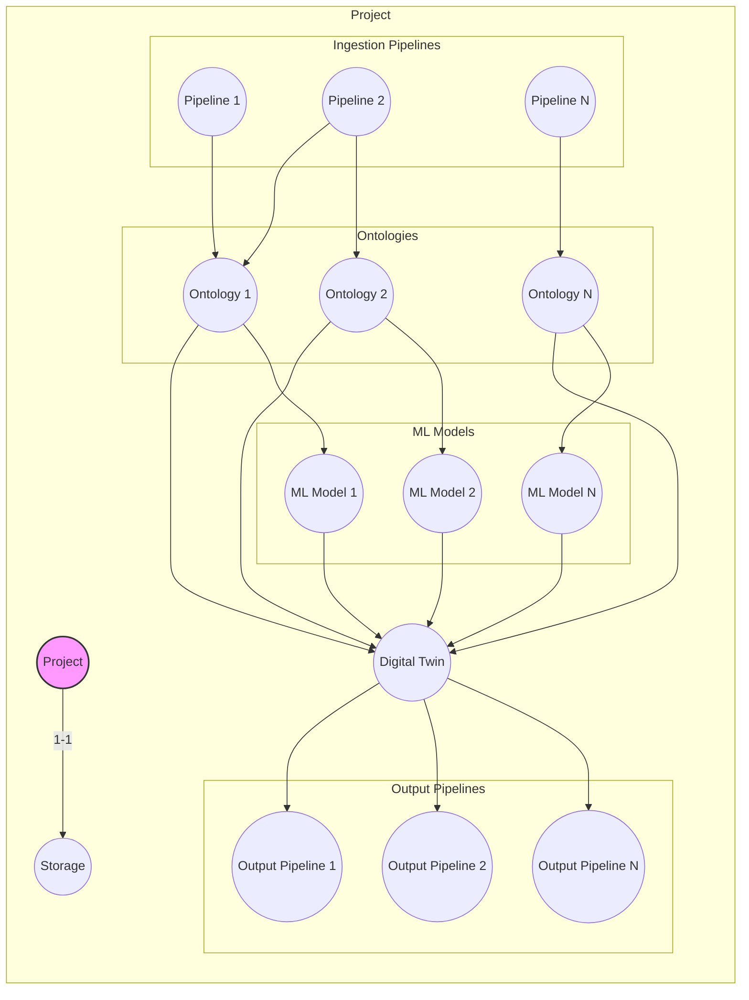

# Overall Plan for Mimir AIP
Mimir AIP will be an ontology-backed data platform for data aggregation, processing, analysis, digital twin creation, management and use(digital twins will be a ontology backed clone of a project encompassing the ontology, ML models, anomaly detection, sparql based querying, outputs[via triggering a output type pipeline to generate reports, send push notifications etc.])
^ All of above will be developed with the ability to trigger via mcp tools, at a later point I will include an AI chat functionality which if users choose can be the primary means on interacting with the system, all system functionality exposed as tools to allow agents(either within the integrated agent chat page OR by using the mcp tools with existing coding-agent systems such as claude code, opencode etc.)

## Languages:
### Backend: Go
### Frontend: Simple static site using a small number of primitive components(7 max) which will call backend orchestrator server via a REST API

## Development:
explained in: [DevelopmentPlan.md](DevelopmentPlan.md)

## Infrastructure:
explained in: [Infrastructure/InfrastructurePlan.md](Infrastructure/InfrastructurePlan.md)

## Projects:
explained in: [Projects/ProjectsPlan.md](Projects/ProjectsPlan.md)

## Ontologies:
explained in: [Ontologies/OntologyPlan.md](Ontologies/OntologyPlan.md)

### Entity Extraction:
explained in: [Ontologies/EntityExtractionPlan.md](Ontologies/EntityExtractionPlan.md)

## Pipelines:
explained in: [Pipelines/PipelinePlan.md](Pipelines/PipelinePlan.md)

### Jobs:
explained in: [Pipelines/JobsPlan.md](Pipelines/JobsPlan.md)

## Storage:
explained in: [Storage/StoragePlan.md](Storage/StoragePlan.md)

## ML Models:
explained in: [MLModels/MLModelPlan.md](MLModels/MLModelPlan.md)

## Digital Twin:
explained in: [DigitalTwins/DigitalTwinPlan.md](DigitalTwins/DigitalTwinPlan.md)

## Heirarchy:

