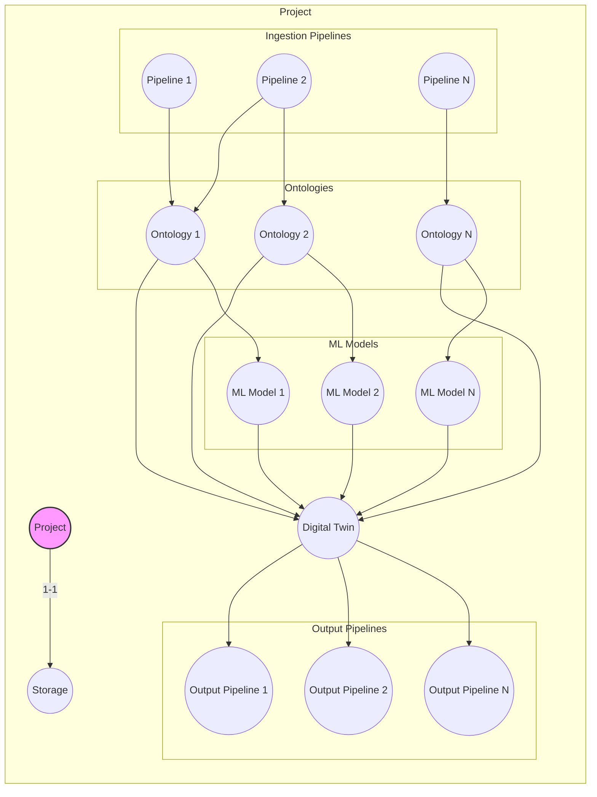

Overall Plan for Mimir AIP
---
Mimir AIP will be an ontology-backed data platform for data aggregation, processing, analysis, digital twin creation, management and use(digital twins will be a ontology backed clone of a project encompassing the ontology, ML models, anomaly detection, sparql based querying, outputs[via triggering a output type pipeline to generate reports, send push notifications etc.])
^ All of above will be developed with the ability to trigger via mcp tools, at a later point I will include an AI chat functionality which if users choose can be the primary means on interacting with the system, all system functionality exposed as tools to allow agents(either within the integrated agent chat page OR by using the mcp tools with existing coding-agent systems such as claude code, opencode etc.)

Languages:
Backend: Go
Frontend: Simple static site using a small number of primitive components(7 max) which will call backend server via a REST API

Infrastructure:
Frontend single kubernetes container
Backend Orchestrater single kubernetes container
Backend workers(can be used to run pipelines, ml models(inference & training), digital twin jobs etc.) scalable kubernetes workers(one worker per job; orchestrater spins this up, worker completes job, returns results to orchestrator and closes)
^Initially during dev this will all be on single system but in theory the workers should be able to scale across a cluster of systems or even remote systems for distributed sclaing.

Storage:
Backend Orchestrater server/container will use an abstract, tabular storage interface and user can use different modular plugins to determine where and how their data is stored(this could be SQL, S3, Mongo, Supabase etc., neo4j etc.) Backend orchestrater should not need to 'care' about how the data is actually being stored the conversion from abstract to specifics for both storage and retrieval is handled by the plugin. 

Heirarchy:

