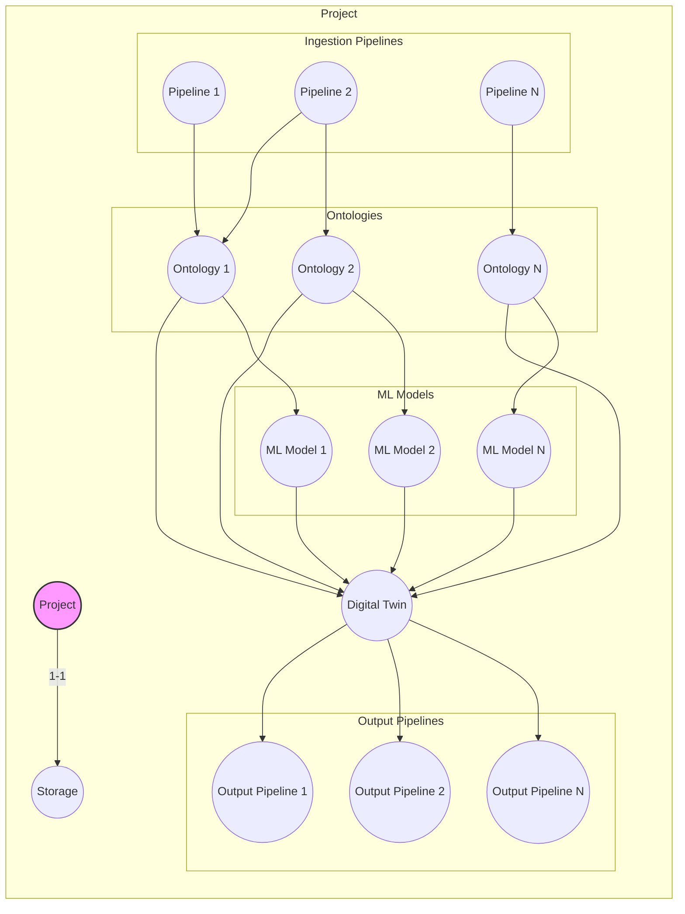

Overall Plan for Mimir AIP
---
Mimir AIP will be an ontology-backed data platform for data aggregation, processing, analysis, digital twin creation, management and use(digital twins will be a ontology backed clone of a project encompassing the ontology, ML models, anomaly detection, sparql based querying, outputs[via triggering a output type pipeline to generate reports, send push notifications etc.])
^ All of above will be developed with the ability to trigger via mcp tools, at a later point I will include an AI chat functionality which if users choose can be the primary means on interacting with the system, all system functionality exposed as tools to allow agents(either within the integrated agent chat page OR by using the mcp tools with existing coding-agent systems such as claude code, opencode etc.)

Languages:
Backend: Go
Frontend: Simple static site using a small number of primitive components(7 max) which will call backend server via a REST API

Infrastructure:
Frontend single kubernetes container
Backend Orchestrater single kubernetes container
Backend workers(can be used to run pipelines, ml models(inference & training), digital twin jobs etc.) scalable kubernetes workers(one worker per job; orchestrater spins this up, worker completes job, returns results to orchestrator and closes)
^Initially during dev this will all be on single system but in theory the workers should be able to scale across a cluster of systems or even remote systems for distributed sclaing.

Projects:
Projects can be thought of as a 'workspace' for a specific use case, project will contain pipelines, ontologies, ML models and digital twins. Each project will have its own storage object which will be used to store all data for that project(ingested pipeline data, ml models, ontologies, digital twin data etc.).

Ontologies:
Ontologies will be used to define the entities, attributes and relationships for a specific project(ideally to ensure retrievability and queryability of all data, a project will have a single all encompassing ontology, however we will alllow for multiple ontologies to be used within a project if users want to keep different data separate). Ontologies will be defined using the standard OWL format. When the user has built their ingestion pipeline, mimir will automatically run this, then feed the ingested data into a extraction process(which will be defined below) to extract the entities, attributes and relationships from the ingested data, this will then be used to automatically build the ontology for the project. Additionally if the user prefers they can then manually edit and overide this to either correct any errors, or use an existing ontology they have built elsewhere. This ontology will be used as a basis for how mimir will then structure and process data(e.g. when the ingestion pipelines execute in future and ingest new data, it will be stored in the storage object in the structure defined by the ontology, additionally when building ML models, the ontology will be used to determine what data is available and how it is structured which will inform the model architecture and training process, finally the ontology will also be used when building the digital twin as this will determine what entities, attributes and relationships are represented in the digital twin).

Pipelnes:
Pipelines will be used for data ingestion, processing and output generation. There will be 3 types of pipeline; ingestion, processing and output(a pipeline can only be defined as one type). Each pipeline will be defined in a YAML format, specifying the steps. Throughout the life of a pipeline there will be a context window(max size to be determined [TODO]) which will store a list of objects(each step gets an object where data can be stored and accessed by ANY subsequent step in pipeline) context is dynamic so any output from a step will be stored in that step's context object. Steps can perform any action from either the builtin default plugin, OR a custom plugin installed by the user. The default plugin includes a variety of common functions such as; managing the context(CRUD operations on the entire context window or specific objects), making http requests, parsing json data, this will also include some basic conditional logic such as if/else statements, GOTO actions to allow for loops. Custom plugins will follow a standardised format.

Storage:
Backend Orchestrater server/container will use an abstract, tabular storage interface and user can use different modular plugins to determine where and how their data is stored(this could be SQL, S3, Mongo, Supabase etc., neo4j etc.) Backend orchestrater should not need to 'care' about how the data is actually being stored the conversion from abstract to specifics for both storage and retrieval is handled by the plugin. The backend orchestrater will convert the project's ontology into a tabular schema which will be used to store data for that project. Plugins may override or ammend/convert this schema as needed to fit the specific storage type, but the backend orchestrater will always interact with the storage through the abstract tabular schema. When pipelines are executed and new data is ingested, this will be stored in the storage according to the structure defined by the ontology and the tabular schema. When ML models are being trained or making inferences, they will retrieve data from storage using the same structure. Finally when building the digital twin, it will also retrieve data from storage to populate the entities, attributes and relationships defined in the ontology.(Digital twins do not store a entire copy of the data rather they query and reference the data, and if data modification it will store only the changed values seperately and reference the original data for unchanged values)

Heirarchy:

