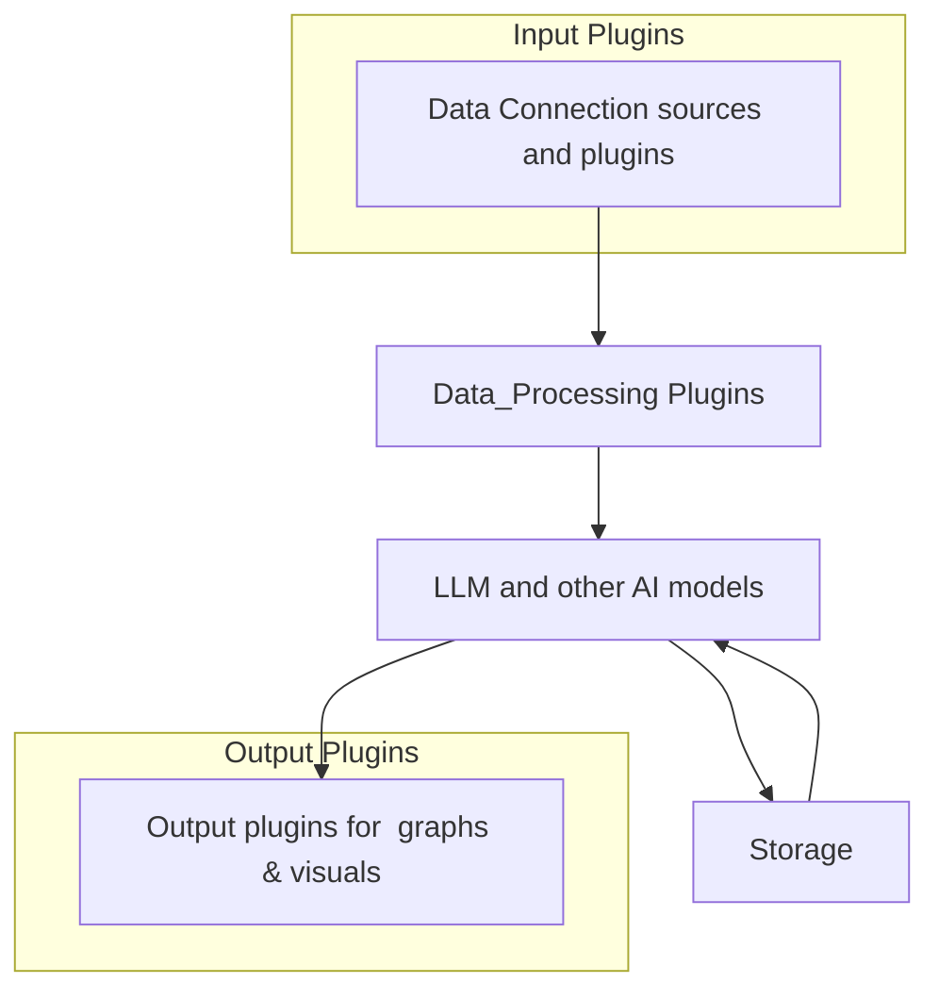

> This repo is a work in progress and is not in a functional state

Rewrite of https://github.com/Mimir-AIP/Mimir-AIP in the Go language, focusing on repliating existing functionality, improving performance, enabling agentic workflows and maintaining cross-compatability with pipeline yaml's created for the python variant.

