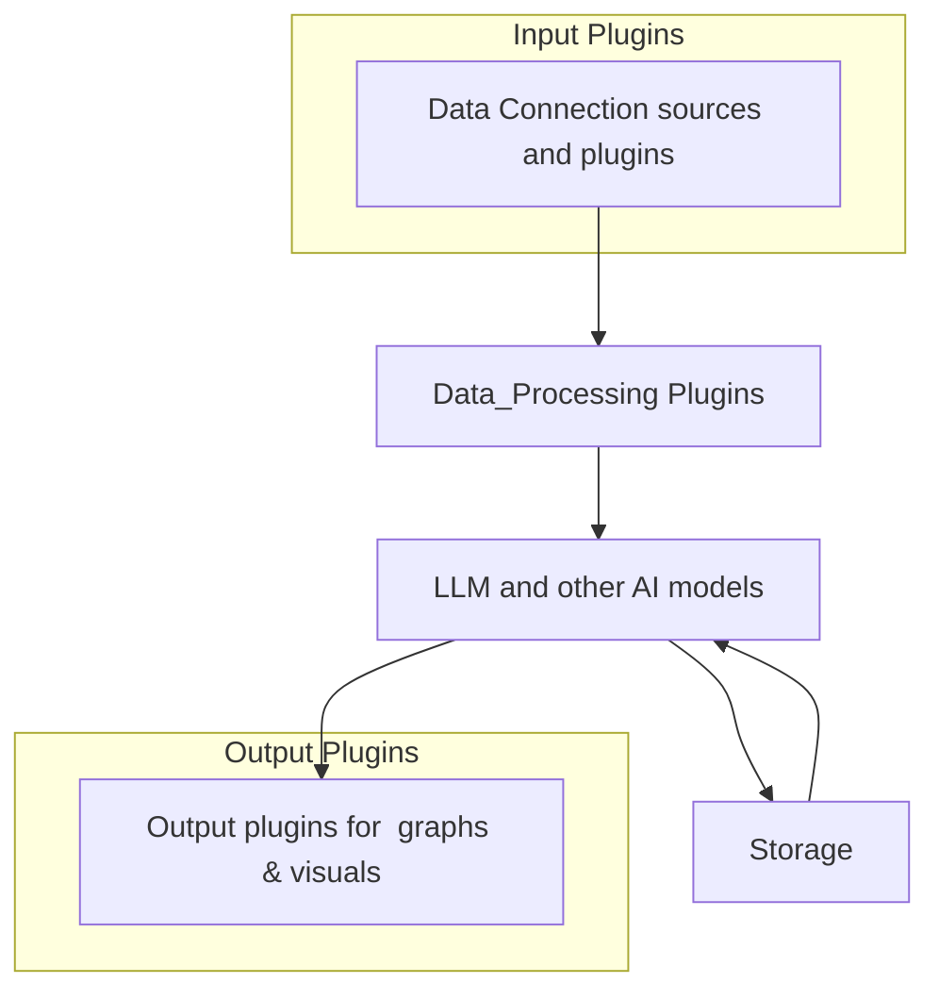

Overview
---
The MIMIR Artificial Intelligence Platform is an open-source framework designed to connect inputs and outputs to AI systems with integrated storage capabilities. The platform is built to provide a modular and flexible architecture, allowing users to easily integrate various components and customize the system to suit their specific needs.

Modular Plugin System
---
MIMIR features a modular plugin system that enables users to extend the platform's functionality through the use of plugins. This system allows for the easy addition of new inputs, outputs, and data processing modules, making it simple to integrate with a wide range of data sources and AI systems.

- Inputs: Plugins can be created to connect to various data sources, such as databases, APIs, or file systems, allowing users to ingest data from multiple sources.
- Outputs: Output plugins enable the platform to send processed data to different destinations, including databases, messaging systems, or file systems.
- Data_Processing: Data processing plugins can be used to perform tasks such as data transformation, filtering, and analysis, allowing users to customize the data processing pipeline.

Support for Large Language Models (LLMs)
---
MIMIR provides support for both locally hosted and remotely hosted Large Language Models (LLMs). This allows users to choose the deployment model that best suits their needs, whether it's hosting their own LLM or leveraging cloud-based services.

Open Alternative to Proprietary Solutions
---
The MIMIR Artificial Intelligence Platform is intended as an open alternative to proprietary solutions like Palantir AIP. By providing a flexible and customizable framework, MIMIR aims to democratize access to AI technology and enable users to build custom solutions that meet their specific requirements.

