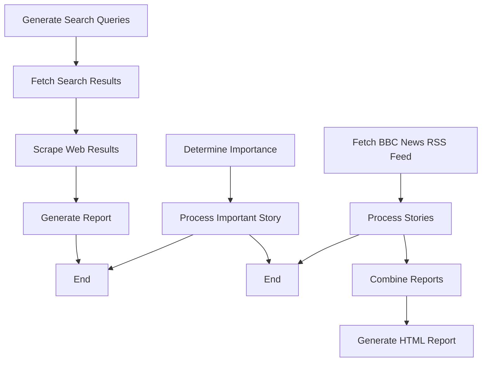

# Mimir-AIP


[](LICENSE)
[](https://www.python.org/downloads/)
[](Documentation.md)

## POC: BBC News Report Generator

This branch contains two versions of a Proof of Concept (POC) for generating BBC news reports. The pipeline:

1. Fetches news stories from the BBC News RSS feed
2. Processes each story to determine its importance
3. For important stories (score > 7):
   - Generates a section prompt
   - Creates a section summary
   - Collects the data
4. Writes all section summaries to a file
5. Loads the summaries and generates an HTML report

### Original Version Flowchart



### API Key Setup

The pipeline uses the OpenRouter plugin, which requires API keys. Follow these steps to set up your API keys:

1. Create a `.env` file in the `src/Plugins/AIModels/OpenRouter/` directory
2. Add your OpenRouter API key to the `.env` file:
   ```
   OPENROUTER_API_KEY=your_api_key_here
   ```

### Configuration

The `config.yaml` file controls which pipelines are enabled. You can configure it to run either the original or V2 version of the POC pipeline.

In this branch I have enabled both pipelines and you run the desired one via command line.

### Run Instructions

#### For Original Version
1. Install dependencies:
   ```bash
   pip install -r requirements.txt
   ```
2. Run:
   ```bash
   python src/main.py --pipeline "BBC News Report Generator (Old)"
   ```

#### For V2 Version
1. Install dependencies:
   ```bash
   pip install -r requirements.txt
   ```
2. Run:
   ```bash
   python src/main.py --pipeline "BBC News Report Generator (V2)"
   ```

Both versions will generate:
- `section_summaries.json` with the collected data
- `report.html` in the output directory