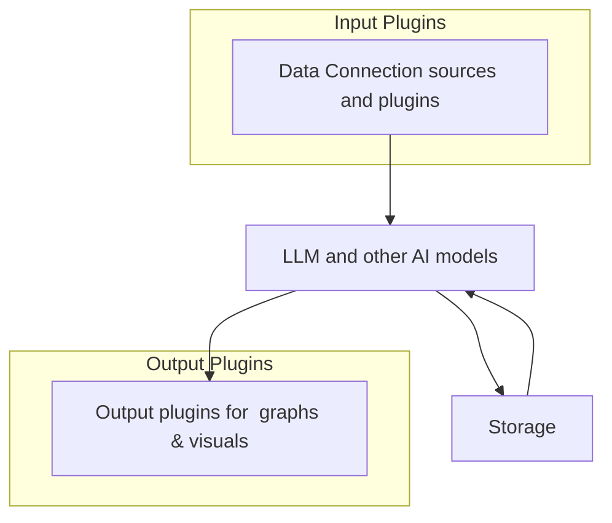

# Mimir-AIP
MIMIR Artificial Intelligence Platform is a framework for connecting Inputs and outputs to AI with storage

```mermaid
flowchart TD
 subgraph subGraph0["Input Plugins"]
        A["Data Connection sources and plugins"]
  end
 subgraph subGraph1["Output Plugins"]
        E["Output plugins for  graphs & visuals"]
  end
    A --> B["LLM and other AI models"]
    B --> C["Storage"] & E
    C --> B

```